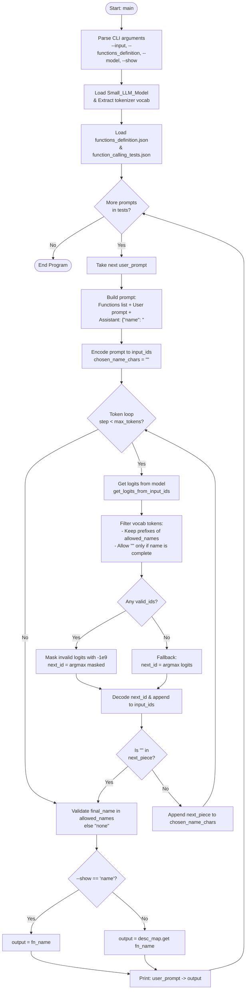

```mermaid
flowchart TD
    A([Start: main]) --> B[Parse CLI arguments<br/>--input, --functions_definition, --model, --show]
    B --> C[Load Small_LLM_Model<br/>& Extract tokenizer vocab]
    C --> D[Load functions_definition.json<br/>& function_calling_tests.json]
    D --> E{More prompts<br/>in tests?}

    E -- No --> Z([End Program])
    E -- Yes --> F[Take next user_prompt]

    F --> G["Build prompt:<br/>Functions list + User prompt +<br/>Assistant: {&quot;name&quot;: &quot;"]
    G --> H[Encode prompt to input_ids<br/>chosen_name_chars = &quot;&quot;]

    H --> I{Token loop<br/>step < max_tokens?}
    I -- No --> P[Validate final_name in allowed_names<br/>else &quot;none&quot;]

    I -- Yes --> J[Get logits from model<br/>get_logits_from_input_ids]
    J --> K[Filter vocab tokens:<br/>- Keep prefixes of allowed_names<br/>- Allow '&quot;' only if name is complete]
    K --> L{Any valid_ids?}

    L -- Yes --> M[Mask invalid logits with -1e9<br/>next_id = argmax masked]
    L -- No --> N[Fallback:<br/>next_id = argmax logits]

    M --> O[Decode next_id & append to input_ids]
    N --> O

    O --> Q{Is '&quot;' in<br/>next_piece?}
    Q -- Yes --> P
    Q -- No --> R[Append next_piece to chosen_name_chars]
    R --> I

    P --> S{--show == 'name'?}
    S -- Yes --> T[output = fn_name]
    S -- No --> U[output = desc_map.get fn_name]

    T --> V[Print: user_prompt -> output]
    U --> V
    V --> E
```